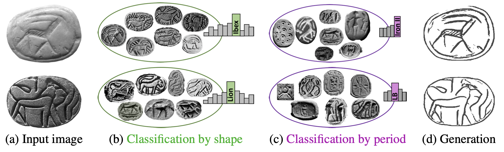

# ArcAid: Analysis of Archaeological Artifacts using Drawings [[Website](https://cgm.technion.ac.il/arcaid/)] [[arXiv](https://arxiv.org/abs/2211.09480)]

## Description

This repository contains the code, dataset and pre-trained models associated with our accepted paper at WACV-2024.



## Paper abstract

Archaeology is an intriguing domain for computer vision. 
It suffers not only from shortage in (labeled) data, but also from highly-challenging data, which is often extremely abraded and damaged. 
This paper proposes a novel semi-supervised model for classification and retrieval of images of archaeological artifacts. 
This model utilizes unique data that exists in the domain—manual drawings made by special artists. 
These are used during training to implicitly transfer the domain knowledge from the drawings to their corresponding images, improving their classification results. 
We show that while learning how to classify, our model also learns how to generate drawings of the artifacts, an important documentation task, which is currently performed manually. Last but not least, we collected a new dataset of stamp-seals of the Southern Levant.

## Contents

- **Code:** Implementation code for the experiments presented in the paper.
- **Data:** CSSL Dataset used in the experiments.
- **Models:** Pre-trained models for image classifiation, retrieval and drawings generation.

## Installation

1. Close the repo:
   ```bash
   git clone https://github.com/offry/Arc-Aid.git
   cd Arc-Aid
   ```
2. Create a virtual env (optional but recommended):
   ```bash
   python -m venv YourEnv
   ```
3. Install the project dependencies:
   ```bash
   pip install -r requirements.txt
   ```
4. Download the [[Dataset](https://drive.google.com/file/d/1A-fPQ8bB9zkPNrYC0U29RpcSQB8-gARw/view?usp=sharing)], into the project dir.

## Citation

If you find our work useful, please consider citing our paper:
```latex
@inproceeding{hayon2024arcaid,
title={ArcAid: Analysis of Archaeological Artifacts using Drawings},
author={O. Hayon and S. Munger and I. Shimshoni and A. Tal},
booktitle={2024 IEEE Winter Conference on Applications of Computer Vision (WACV)},
year={2024}
}
